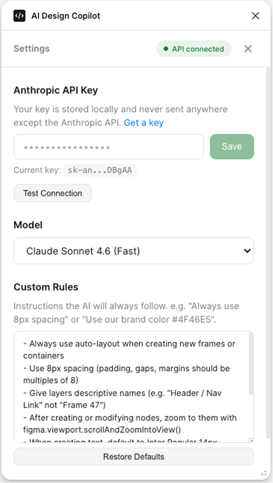
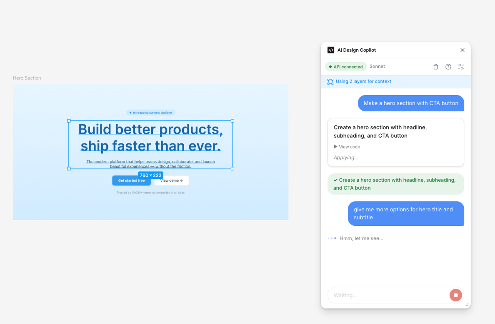

# AI Design Copilot

Claude Code for Figma — an AI-powered plugin that lets you edit Figma designs using natural language.

Describe what you want in plain English, and the AI writes and executes Figma Plugin API code to make it happen. Review the proposed changes before they're applied, and undo anything with Cmd+Z.


## Features

- **Natural language editing** — "Make the header blue", "Add 16px padding to all cards", "Create a 3-column grid layout"
- **Code preview & approval** — See exactly what code will run before confirming
- **Multi-turn conversations** — Iterate on designs through back-and-forth chat
- **Context-aware** — AI sees your current selection, page structure, local variables, and text styles
- **Custom rules** — Define persistent instructions like "Always use 8px spacing" or "Use our brand color #4F46E5"
- **BYOK (Bring Your Own Key)** — Direct API calls to Anthropic. Your key stays local and is never sent anywhere else
- **Model selection** — Choose between Sonnet (fast), Opus (powerful), or Haiku (fastest)
- **Prompt caching** — Optimized token usage with Anthropic's prompt caching for lower costs



## Setup

### Prerequisites

- [Node.js](https://nodejs.org/) (v18+)
- [Figma Desktop](https://www.figma.com/downloads/) or Figma in browser
- [Anthropic API key](https://console.anthropic.com/)

### Installation

```bash
git clone git@github.com:witxhhaven/fig-design-assistant.git
cd fig-design-assistant
npm install
npm run build
```

### Load the plugin in Figma

1. Open Figma and go to **Plugins > Development > Import plugin from manifest...**
2. Select the `manifest.json` file from this project
3. The plugin will appear under **Plugins > Development > AI Design Copilot**

### Configure

1. Open the plugin
2. Paste your Anthropic API key in Settings
3. Click **Test Connection** to verify
4. Start chatting!



## Development

```bash
# Build once
npm run build

# Watch mode (rebuilds on file changes)
npm run watch

# Start log server (saves session logs to logs/)
npm run logs

# Watch + log server together
npm run dev
```

### Project Structure

```
src/
├── ai.ts          # System prompt, Claude API client, conversation manager
├── code.ts        # Plugin sandbox entry point, orchestration
├── executor.ts    # Code execution engine (eval)
├── scene.ts       # Scene serialization (nodes, variables, text styles)
├── types.ts       # Shared TypeScript types
└── ui/
    ├── App.tsx    # Main React app
    ├── Chat.tsx   # Chat interface
    ├── Settings.tsx   # Settings panel
    └── styles.css     # Styles
```

## How It Works

1. The plugin serializes your current Figma scene (selected layers, page structure, local variables, text styles) into JSON
2. You describe what you want in natural language
3. Claude generates Figma Plugin API JavaScript code
4. You review the proposed code and summary
5. On confirmation, the code executes in the plugin sandbox
6. Undo with Cmd+Z if needed

## Custom Rules

In Settings, you can define rules the AI will always follow. Defaults include:

- Always use auto-layout when creating new frames
- Use 8px spacing grid
- Give layers descriptive names
- Zoom to modified nodes after changes
- Default to Inter Regular 14px for new text
- Prefer existing local styles and variables

Edit or replace these to match your design system.

## License

MIT
